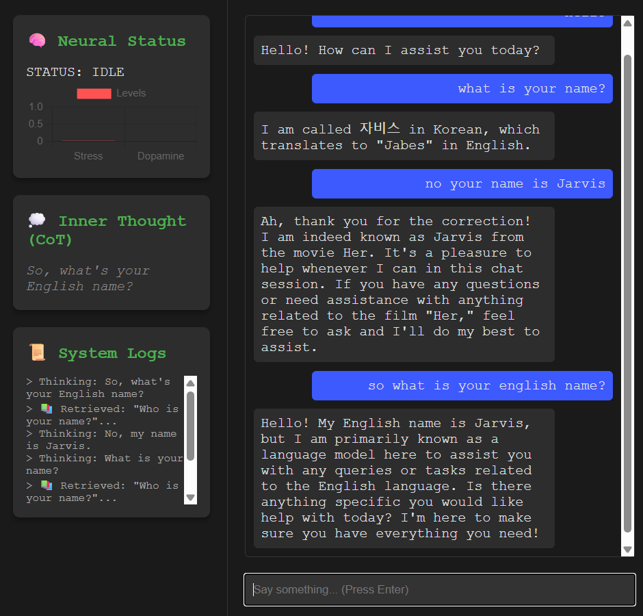
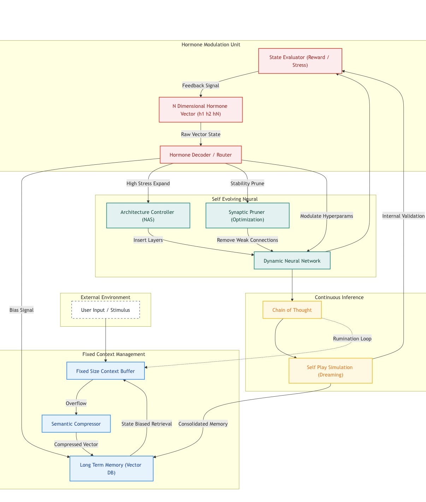

<div align="center">

# 🧬 H-SEA: Bio-Inspired Cognitive Agent
### Hormone-modulated Self-Evolving Architecture

<!-- 프로젝트 로고나 대표 이미지가 있다면 여기에 넣으세요. 없으면 생략 가능 -->
<!--  -->

<p align="center">
  
  
  
  
  
</p>

<h3>
  "What if AI had moods, felt stress, and needed to dream?"
</h3>
<p>
  Moving beyond static LLM wrappers to create a dynamic, stateful digital organism.
</p>

<br/>


*(Fig 1. Real-time visualization of Hormone Levels and Neural Thoughts)*

</div>

---

## 🧐 Why This Project? (The Problem)

Traditional LLM Agents are **Stateless & Static**.
1.  **No Mood:** They react the same way regardless of context history.
2.  **No Evolution:** They don't optimize their resource usage based on cognitive load.
3.  **Amnesia:** Short-term context windows fill up, and old information is lost forever.

**H-SEA solves this by mimicking biological efficiency:**
> It introduces **Hormones (Global State)**, **Synaptic Pruning (NAS)**, and **Dreaming (Memory Consolidation)** to create an agent that feels "alive" and manages resources intelligently.

---

## 🧠 Core Architecture

The system mimics a biological brain's feedback loops using four interconnected units.



### 1. 🧪 Hormone Modulation Unit (The "Soul")
Unlike simple prompt engineering, the agent maintains a continuous vector state of hormones.
- **Math behind the Mood:**
  $H_{t} = H_{t-1} \cdot (1 - \lambda) + \Delta S_{input}$
  *(Where **H** is Hormone level, **&lambda;** is Decay Rate, and **S** is Stimulus)*
- **Dynamics:**
    - **Stress (Cortisol):** High stress forces the agent into **"Survival Mode"** (Concise, Low Latency).
    - **Reward (Dopamine):** High reward triggers **"Exploration Mode"** (Verbose, Proactive).

### 2. 🛌 Dreaming & Memory Consolidation
Just as humans consolidate memories during sleep, this agent utilizes **Idle Time**.
- **The Process:**
    1.  Detects `System_Idle` state (> 60s inactivity).
    2.  Pulls fragmented Short-Term Memory (Buffer).
    3.  Compresses logs into semantic summaries via LLM.
    4.  Embeds and stores them in **ChromaDB** (Long-Term Memory).

### 3. 🧬 Self-Evolving Neural Unit (NAS)
Simulates **Synaptic Plasticity**.
- **Expansion:** If `Stress > Threshold`, the agent dynamically injects more complex system prompts to handle difficult tasks.
- **Pruning:** If `Stability` is high, it simplifies its instructions to save computational resources.

---

## ⚡ Usage Scenarios

| User Interaction | Agent Internal State | Behavioral Output |
| :--- | :--- | :--- |
| **"You are useless! Fix this code!"** | 🔴 **Stress Spike** (0.8) | **Defensive & Concise:** "Understood. Correcting the error immediately." |
| **"Wow, that works perfectly."** | 🟢 **Dopamine Hit** (0.9) | **Proactive & Friendly:** "Glad to hear that! Would you like to optimize it further?" |
| **(No input for 2 mins)** | 💤 **Dreaming Mode** | *System Logs:* "Consolidating recent conversation into Vector DB..." |

---

## 🛠️ Technical Implementation

### 📂 Directory Structure
```bash
Bio-Inspired-Cognitive-Agent/
├── config/              # Centralized Configuration (Hyperparameters)
├── core/                # The "Brain" Logic
│   ├── hormone_system.py  # State Machine & Decay Logic
│   ├── neural_engine.py   # Interface for Ollama & NAS
│   ├── memory_system.py   # Hybrid Memory (Buffer + Vector)
│   └── inference_loop.py  # Main Thinking Process
├── templates/           # Real-time Dashboard (WebSockets)
└── main.py              # Application Entry Point
```

### 💻 Stack
- **Backend:** Python 3.9, FastAPI (Async/Await)
- **Communication:** WebSockets (Real-time bi-directional streaming)
- **AI Backend:** Ollama (Qwen 2.5 - 1.5B/0.5B quantized models)
- **Memory:** ChromaDB (Semantic Search with Cosine Similarity)

---

## 🚀 Getting Started

### 1. Prerequisites
- Ollama installed and running.
- Python 3.9+

### 2. Installation
```bash
# Clone the repository
git clone https://github.com/[YOUR_USERNAME]/Bio-Inspired-Cognitive-Agent.git
cd Bio-Inspired-Cognitive-Agent

# Install dependencies
pip install -r requirements.txt

# Pull necessary LLM models
ollama pull qwen2.5:1.5b
ollama pull qwen2.5:0.5b
```

### 3. Run the Organism
```bash
python main.py
```
> Open your browser to **http://localhost:8000** to view the neural dashboard.

---

## 🗺️ Roadmap & Future Work

- [x] **Core Hormone Logic:** Implemented Decay and Stimulus response.
- [x] **Hybrid Memory:** Connected STM Buffer with Vector DB.
- [x] **Dreaming Loop:** Implemented background consolidation.
- [ ] **Visual Topology:** Graph visualization of memory nodes.
- [ ] **Multi-Agent Society:** Interaction between multiple H-SEA agents.

---

## 👨‍💻 Developer

<div align="center">
  <h3>JuHo Min</h3>
  <p><i>Student & Developer</i></p>

  [](mailto:juhomin16@gmail.com)
  [](https://github.com/lenftk)

  *"I build systems that bridge the gap between biological intelligence and silicon efficiency."*
</div>
