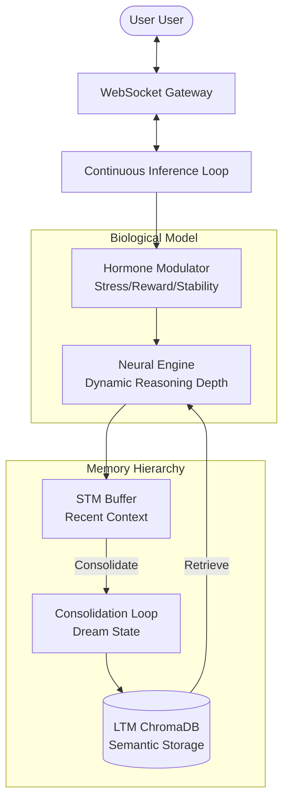

# 🧬 Bio-Inspired Cognitive Agent (H-SEA)

<div align="center">
  
  
  
  <br/>
  
  
  
  
</div>

---

### 🌿 "What if AI had moods and needed to dream?"

**H-SEA (Hormone-modulated Self-Evolving Agent)** is an experimental cognitive architecture that simulates biological brain processes. It moves beyond static instruction-following by maintaining a dynamic internal "chemical" state that modulates reasoning depth, emotional tone, and memory consolidation.

> [!IMPORTANT]
> This is a scientific exploration into **Biologically Plausible AI**. It simulates hormone-driven behavior, synaptic pruning, and autonomous memory management.

---

## �️ Core Cognitive Pillars

<table align="center">
  <tr>
    <td align="center"><b>🧪 Hormone System</b><br/>Stress, Reward, Stability</td>
    <td align="center"><b>🧠 Hybrid Memory</b><br/>STM Buffer + LTM Vector Store</td>
    <td align="center"><b>🧬 Neuro-Evolution</b><br/>Dynamic NAS & Pruning</td>
  </tr>
</table>

### 1. Hormonal Modulation (The "Mood" Engine)
The agent calculates real-time levels of **Stress** and **Reward** based on interaction sentiment. 
- **High Stress:** Triggers "Defensive Style" — concise, resource-efficient, and prioritized.
- **High Reward:** Triggers "Proactive Style" — creative, inquisitive, and exploratory.

### 2. Dreaming & Memory Consolidation
When the system is idle, it enters a **"Dream State"**. It reviews fragmented short-term memories (STM), summarizes them for long-term relevance, and embeds them into **ChromaDB** (LTM).

### 3. Dynamic Neural Complexity
Simulates **Synaptic Plasticity**. The agent expands its reasoning complexity during high-load tasks and "prunes" (simplifies) its logic during periods of high stability to optimize token usage and response speed.

---

## 🏗️ System Architecture



---

## 🎬 Usage Scenarios

> [!TIP]
> **Try this:** Compliment the agent to see its "Reward" hormone spike, or challenge it to see how its "Stress" modulates its reasoning depth.

| Interaction | Agent State | Behavioral Shift |
| :--- | :--- | :--- |
| **"Thank you, you're amazing!"** | 😊 EUPHORIC | Becomes more conversational and creative. |
| **"Stop failing, this is bad."** | ⚠️ STRESSED | Becomes concise, formal, and focuses on error correction. |
| **System Idle (1 min)** | 💤 DREAMING | Performs background memory consolidation and self-evolution. |

---

## 🛠️ Technical Stack

- **Core:** Python 3.9+ with NumPy for physiological state simulation.
- **Inference:** [Ollama](https://ollama.ai/) running `Qwen 2.5` (Optimized for low-latency reasoning).
- **Storage:** [ChromaDB](https://www.trychroma.com/) for high-dimensional semantic search.
- **Interface:** FastAPI & WebSockets for real-time visualization of internal thoughts.

---

## 🚀 Getting Started

1. **Prerequisites**
   - Install [Ollama](https://ollama.ai/)
   - `ollama pull qwen2.5:1.5b`
   - `ollama pull qwen2.5:0.5b`

2. **Installation**
   ```bash
   git clone https://github.com/[YOUR_USERNAME]/Bio-Inspired-Cognitive-Agent.git
   cd Bio-Inspired-Cognitive-Agent
   pip install -r requirements.txt
   ```

3. **Launch**
   ```bash
   python main.py
   ```
   *Dashboard available at: `http://localhost:8000`*

---

## �‍💻 Developer & Vision

**JuHo Min**  
*Student & Developer*

> "I am passionate about building AI systems that mimic biological efficiency and adaptability. This project is a step towards agents that don't just compute, but experience."

---

<div align="center">
  
</div>

[](./LICENSE)